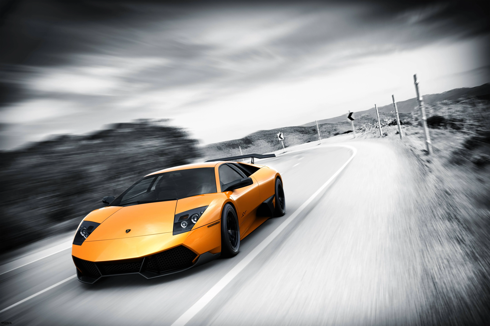
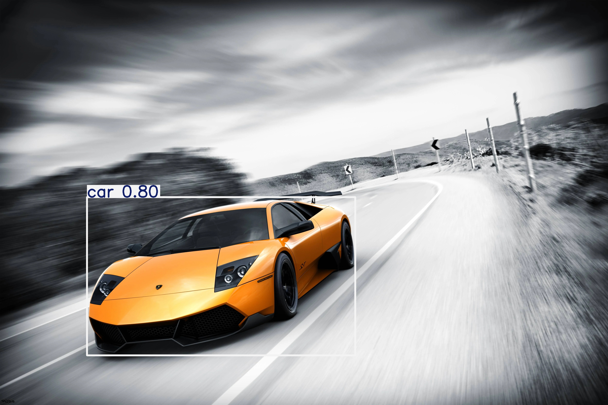

# YOLOv8 Object Detection 🚀

This project demonstrates object detection using the **YOLOv8** model from the `ultralytics` library. It supports images, videos, and webcam input.

---

## 📁 Project Structure

yolov8/
├── detect.py # Main script for object detection
├── sample/ # Folder containing test image(s)
│ └── test.jpg
├── outputs/ # Results saved here after detection
├── yolov8n.pt # YOLOv8 nano model (downloaded automatically or manually)
├── requirements.txt # Python dependencies
└── README.md # Project documentation

---

## 🛠️ Dependencies

- Python 3.8 or higher
- Ultralytics YOLOv8 (`ultralytics` library)

Install dependencies with:

```bash
pip install -r requirements.txt
```
---

## 🚀 How to Run

1. Run on an Image
```bash
python detect.py --source sample/test.jpg
```
2. Run on a Video
```bash
python detect.py --source path/to/video.mp4
```
3. Run on Webcam (default camera)
```bash
python detect.py --source 0
```
The results will be saved in outputs/yolov8_results/.

---

## Input

<p align="center">
  
</p>

---

## output

<p align="center">
  
</p>


